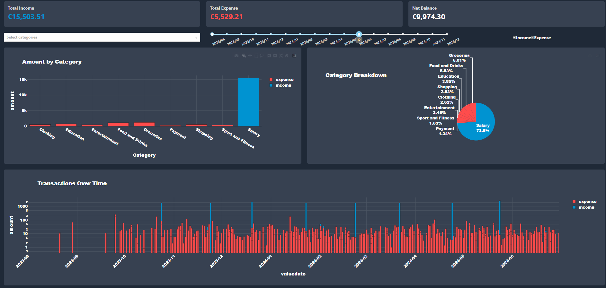
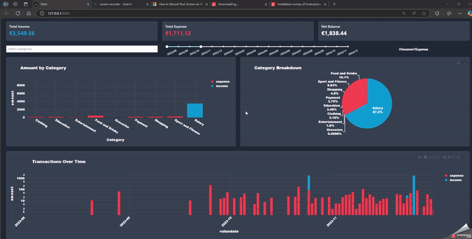

# finance_viz
Automate visualization and tracking of monthly finances. Refer to the develop branch for latest updates.

**Meet finance_viz — your money’s new highlight-reel.
Plug in a spreadsheet and watch every euro sprint onto a slick, dark-mode dashboard: animated bars for spending bursts, donut slices for sneaky costs, KPIs that flip in real-time when you drag the date slider.
Stop squinting at rows and start seeing where your cash goes — finance_viz turns raw transactions into instant, scroll-stopping stories.**

P.S: Recommender system coming soon. Maybe 😁

## Sneak Peek

<!-- Static screenshot -->


<!-- Short looping video (GitHub renders <video> tags) -->



# Installation and Usage (Developer Section)
Installation instructions differ slightly for Windows and MacOS/Linux based users.

## Pre-reqs:
1. Git bash <https://git-scm.com/downloads>.
2. Python (version 3.x)
3. Virtual environment set up for the project. For instance, [venv](https://docs.python.org/3/library/venv.html) or [miniconda](https://docs.anaconda.com/miniconda/).

### Common for all OS:
Clone the repository:
   ```bash
   cd  path/to/your/directory
   git clone https://github.com/ShekharNarayanan/finance_viz.git
   ```

### For windows:
```bash
cd path/to/your/directory
pip install -r requirements.txt
```
### MacOS/ Linux 
_Add conda env creation instructions here and possibly for the windows version as well_. Link to https://stackoverflow.com/questions/70205633/cannot-install-python-3-7-on-osx-arm64
1. Navigate to your directory
```bash
cd path/to/your/directory
```
2. Give permission to run the shell script and then run it:
```bash
chmod +x install_reqs_on_mac_os.sh
shell install_reqs_on_mac_os.sh
```
3. Install the local package
After creating the environment, write:
```bash
pip install -e .
```
This makes the finance_viz module available everywhere in the notebooks where you can develop your own customizations.

### Recommended:
1. If you wish to upload your versions of the jupyter notebooks for visualization or analysis of transaction data, please consider removing sensitive outputs before you push.

### Pending instructions and credits:
Give proper credit to this [repository](https://github.com/thu-vu92/local-llms-analyse-finance) for the brilliant idea of using a local LLM.
Add ollama installation instructions

 
